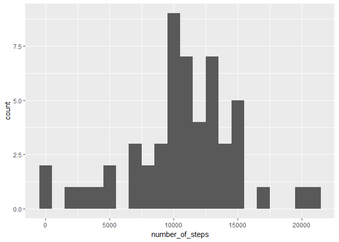
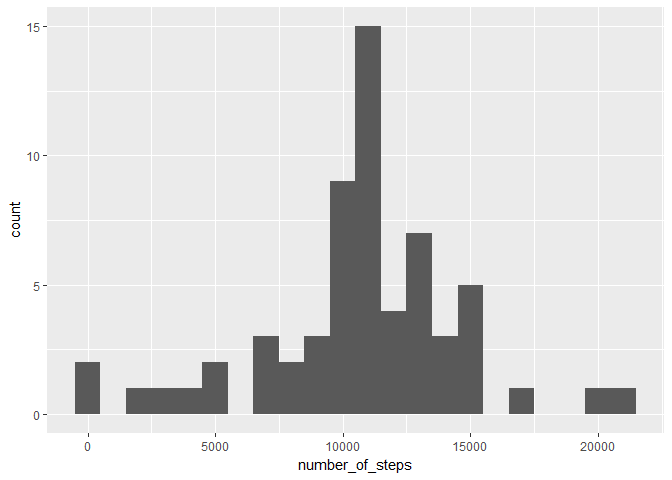
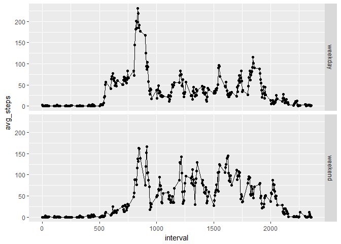

# Reproducible Research: Peer Assessment 1


## Loading and preprocessing the data

```r
#load data
library(dplyr)
```

```
## Warning: package 'dplyr' was built under R version 3.3.2
```

```
## 
## Attaching package: 'dplyr'
```

```
## The following objects are masked from 'package:stats':
## 
##     filter, lag
```

```
## The following objects are masked from 'package:base':
## 
##     intersect, setdiff, setequal, union
```

```r
act<- read.csv("activity.csv")
act<-tbl_df(act)
```


## What is mean total number of steps taken per day?

```r
library(ggplot2)
```

```
## Warning: package 'ggplot2' was built under R version 3.3.2
```

```r
#process data 
total<-aggregate(act$steps,list(act$date),FUN = sum)
names(total)<-c("date","number_of_steps")

#task1

qplot(number_of_steps,data = total,binwidth = 1000)
```

```
## Warning: Removed 8 rows containing non-finite values (stat_bin).
```

<!-- -->

```r
mean(total$number_of_steps, na.rm=TRUE)
```

```
## [1] 10766.19
```

```r
median(total$number_of_steps, na.rm=TRUE)
```

```
## [1] 10765
```


## What is the average daily activity pattern?

```r
total2<-aggregate(as.numeric(act$steps),list(act$interval),FUN = mean,na.rm = TRUE)
names(total2)<-c("Time_interval","Avg_Steps")
qplot(x = Time_interval,y = Avg_Steps, data = total2) + geom_line() + xlab("Time interval of 5 seconds") + ylab("Average number of steps per day") + labs(main = "Time Series Plot")
```

<!-- -->

### On average across all the days in the dataset, the 5-minute interval contains the maximum number of steps?


```r
max<-total2[which.max(total2$Avg_Steps),] #maximum value
max
```

```
##     Time_interval Avg_Steps
## 104           835  206.1698
```

## Imputing missing values
### number of NA values

```r
sum(is.na(act$steps))
```

```
## [1] 2304
```

### fill in missing values in dataset


```r
total2<-aggregate(as.numeric(act$steps),list(act$interval),FUN = mean,na.rm = TRUE)
names(total2)<-c("interval","steps")
fill.value <- function(steps, interval) {
  filled <- NA
  if (!is.na(steps))
    filled <- c(steps)
  else
    filled <- (total2[total2$interval==interval, "steps"])
  return(filled)
}

act$steps <- mapply(fill.value, act$steps, act$interval)
total<-aggregate(act$steps,list(act$date),FUN = sum)
names(total)<-c("date","number_of_steps")
```

### plotting data


```r
qplot(number_of_steps,data = total,binwidth = 1000)
```

<!-- -->

```r
mean(total$number_of_steps, na.rm=TRUE)
```

```
## [1] 10766.19
```

```r
median(total$number_of_steps, na.rm=TRUE)
```

```
## [1] 10766.19
```


## Are there differences in activity patterns between weekdays and weekends?


```r
library(lubridate)
```

```
## Warning: package 'lubridate' was built under R version 3.3.2
```

```
## 
## Attaching package: 'lubridate'
```

```
## The following object is masked from 'package:base':
## 
##     date
```

```r
w1<-wday(act$date)
for (i in 1:17568)
{
  g<- w1[i]
  
  if(g>=7|g<=1)
  {
    act[i,"day"] <- "weekend"
  }
  else
  {
    act[i,"day"] <- "weekday"
  }
}

total<-aggregate(act$steps ,list(act$interval,act$day) ,FUN = mean,na.rm = TRUE)
names(total)<- c("interval", "day", "avg_steps")
qplot(interval,avg_steps,data = total,facets = day~.) + geom_line()
```

<!-- -->


